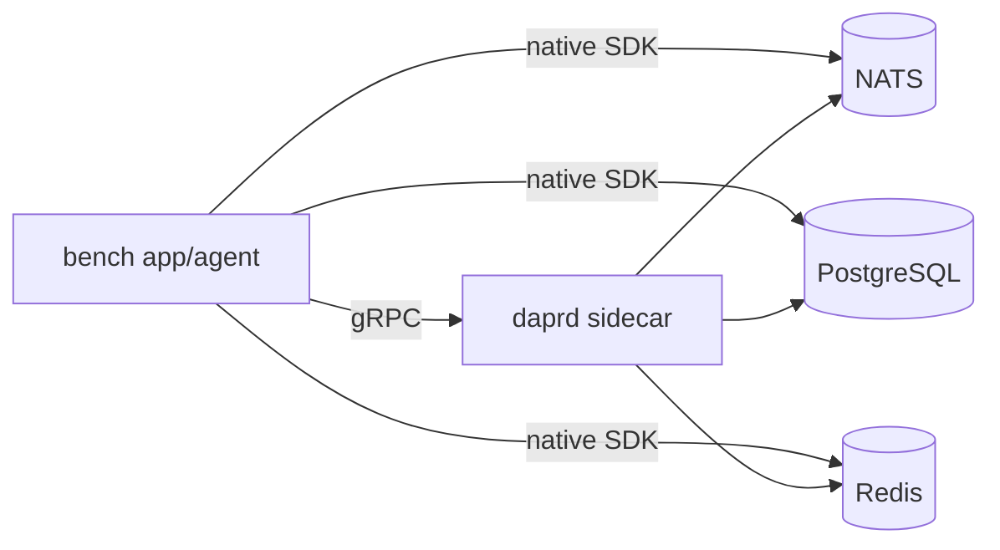

# Dapr Bench

[Dapr](https://dapr.io) is an open-source, portable runtime designed to help developers build resilient,
secure, microservices-based distributed applications and AI agents.
However, it comes with an I/O overhead caused by the additional layer introduced by Dapr.
In this work, we run the same workload against each of **NATS**, **PostgreSQL**, and **Redis**
twice: once through the native Go SDK and once through Dapr. The load is swept along three
dimensions, and every step is recorded as a trace, so the overhead becomes a curve, not a guess.
These results should be taken into consideration when deciding whether to switch to Dapr.

> As Gamora asked Thanos: **“What did it cost?”**
> And Thanos replied: **“Everything.”**

## The six connectors

| Connector         | Path                                | Operations      |
| ----------------- | ----------------------------------- | --------------- |
| `nats-direct`     | app → nats.go (JetStream, acked)    | `publish`       |
| `nats-dapr`       | app → gRPC → daprd → NATS JetStream | `publish`       |
| `postgres-direct` | app → pgx → PostgreSQL              | `write`, `read` |
| `postgres-dapr`   | app → gRPC → daprd → PostgreSQL     | `write`, `read` |
| `redis-direct`    | app → go-redis → Redis              | `write`, `read` |
| `redis-dapr`      | app → gRPC → daprd → Redis          | `write`, `read` |

A run compares **one pair** — a backend's direct and Dapr connectors — and never more than
two connectors. Within a run the two are measured **one at a time**, never concurrently, so
the backend and the sidecar only ever serve the connector being measured. The only difference
within a pair is the sidecar hop.



## Quick start

```sh
make sweep BACKEND=redis     # build + start the stack, sweep redis-direct vs redis-dapr, follow the log
make sweep-all               # nats, postgres, redis back to back, one trace file each
make plots                   # charts + summary tables from traces/*.jsonl into plots/
make down                    # tear everything down
```

A sweep writes `traces/<timestamp>-<backend>.jsonl` and exits. While it runs, bench metrics are
on <http://localhost:9100/metrics>, the sidecar's on <http://localhost:9090/metrics>, and
Prometheus on <http://localhost:9091>.

## How a sweep works

Load has three dimensions, and the sweep varies each one while holding the other two at a
baseline (`SWEEP_MODE=oat`, one at a time), or measures every combination (`SWEEP_MODE=grid`):

| Dimension           | Baseline   | Levels swept (default)   | Meaning                                     |
| ------------------- | ---------- | ------------------------ | ------------------------------------------- |
| `RATE`              | 200 ops/s  | `0, 50, 200, 1000, 5000, 20000, 50000, 100000` | requests per second the callers try to send |
| `PAYLOAD_BYTES`     | 256 B      | `256, 1024, 4096, 16384` | value size per operation                    |
| `CONCURRENCY`       | 8 callers  | `1, 8, 32, 128`          | concurrent callers ("agents")               |

For every point the sweep, in order:

1. sets the payload size, then for each connector of the pair:
2. **seeds** the keyspace through the connector's `write` op, so a `read` never misses;
3. runs a **warmup** (`STEP_WARMUP`, discarded);
4. **measures** for `STEP_DURATION`, then rests for `STEP_COOLDOWN` before the next connector.

Operations of a connector alternate (`write`, `read`, `write`, ...) and each is timed on its
own, so a connector with two ops reports two records per point.

### Open-loop load and stall time

With a `RATE`, the load is **open loop**: operation *k* is due at `start + k / RATE` whether or
not the previous ones have returned, exactly as a fleet of agents keeps arriving regardless of
how the backend is doing. Each caller takes the next due operation; if it is already overdue,
the overdue time is recorded as **stall** — the queueing delay the caller sat through before
the call could even begin.

| Measure     | What the timer brackets                                             |
| ----------- | ------------------------------------------------------------------- |
| **latency** | the call itself, from send to return                                |
| **stall**   | from the moment the operation was due to the moment the call began  |
| **wait**    | stall + latency: what an agent experiences, from wanting to done    |

Stall is zero while a connector keeps up with the target rate, and grows for the whole
window once it cannot. That is the number for agentic workloads: latency says how fast a
call is, stall says how long agents queue behind a saturated path. Because stall is
measured against the schedule rather than the previous call, the results are not subject
to coordinated omission — a slow connector cannot hide its slowness by sending less.

`RATE=0` is a **closed loop**: each caller fires again as soon as its call returns, so the
throughput measured is the path's ceiling rather than a target. Stall is not defined there
and is reported as zero. The default sweep includes one closed-loop point on the RPS axis, so
every run carries both the paced comparison and each path's capacity.

### Reading throughput

At a fixed target rate, throughput is an input: a path that keeps up delivers exactly the
target, so both lines sit on the same diagonal and the interesting numbers are latency and
stall. Throughput only separates the two paths once one of them cannot keep up, which is why
the rate axis climbs to 100000 and ends with the closed-loop point. Read it as: the RPS at
which the Dapr line bends away from the diagonal is where the sidecar saturates, and the
closed-loop point is how much each path can do at all.

## Traces

Every step is one JSON line in `traces/<sweep>.jsonl`, after a header line describing the
plan. A record carries the point, the connector, and every measurement:

```json
{"type":"step","sweep":"20260927T101500Z-redis","captured_at":"2026-09-27T10:16:22Z",
 "dimension":"rate","rate":1000,"payload_bytes":256,"concurrency":8,"keyspace":1000,
 "connector":"redis-dapr","backend":"redis","mode":"dapr","op":"write",
 "paced":true,"elapsed_seconds":30.0,"achieved_rate":998.7,
 "ops":14981,"errors":0,"timeouts":0,"throughput":499.4,
 "latency":{"p50":0.00071,"p95":0.00112,"p99":0.00164,"mean":0.00075,"max":0.0121},
 "stall":{"p50":0.00002,"p95":0.00009,"p99":0.00031,"mean":0.00003,"max":0.0018},
 "wait":{"p50":0.00073,"p95":0.00119,"p99":0.00181,"mean":0.00078,"max":0.0126}}
```

Times are seconds. A record whose `errors` is non-zero also carries `first_error`, the message
of the first failure, so an error count is never a mystery. `throughput` counts successful
operations per second of the measured window; `achieved_rate` is what the connector actually issued across all its ops, against the
target `rate`. `dimension` says which axis the point belongs to (`baseline` is the point
shared by all three curves in one-at-a-time mode). Percentiles come from a log-linear
histogram with 1% resolution, computed in the app from every operation of the step, not
sampled from a scrape.

### Plotting

```sh
make plots                              # every trace
make plots FILES="traces/2026*-redis.jsonl"
```

For each backend, operation and dimension this writes one SVG into `plots/<backend>/`
(`write_vs_rps.svg`, `read_vs_payload.svg`, `write_vs_users.svg`, ...) with four panels —
p50 latency, p99 latency, throughput, error rate — and a direct and a Dapr line in each. Direct
is always a solid blue line, Dapr always a dashed orange one, so the two stay tellable where they
overlap. Throughput against RPS is on a log axis: a path that keeps up with its target is a
straight diagonal, and one that falls behind bends away from it. The closed-loop point sits in
its own slot at the right end of the RPS axis, as a lone marker, since it is a ceiling rather
than a rate. Next to the charts, `plots/<backend>/summary.md` tabulates
every point with the Dapr-vs-direct ratio, and the same table is printed to stdout. The p95,
stall and wait numbers are in the trace records for anyone who wants to chart them.

It is **standard-library Python only**: no matplotlib, no virtualenv. If two traces cover the
same point, the later capture wins.

## Configuration

All knobs are environment variables on the `bench` service in
[docker-compose.yml](deploy/docker-compose.yml); each can be overridden on the `make` line.

| Variable                                     | Meaning                                                          |
| -------------------------------------------- | ---------------------------------------------------------------- |
| `CONNECTORS`                                 | the pair to compare, e.g. `nats-direct,nats-dapr` (at most two)  |
| `RATE`, `PAYLOAD_BYTES`, `CONCURRENCY`       | the baseline point                                               |
| `SWEEP_RATE`, `SWEEP_PAYLOAD_BYTES`, `SWEEP_CONCURRENCY` | levels per dimension; set a list empty to skip that dimension |
| `SWEEP_MODE`                                 | `oat` (default) or `grid`                                        |
| `KEYSPACE`                                   | distinct keys cycled through                                     |
| `STEP_WARMUP`, `STEP_DURATION`, `STEP_COOLDOWN` | per connector per point: discarded, measured, idle             |
| `OP_TIMEOUT`                                 | per-operation deadline; a hit counts as an error and a timeout   |

```sh
# a longer, narrower experiment: only the rate axis, one minute per step
make sweep BACKEND=postgres SWEEP_PAYLOAD_BYTES= SWEEP_CONCURRENCY= \
  SWEEP_RATE=100,500,2000,10000 STEP_DURATION=60s
```

The default sweep is 14 points; at two connectors and 40 seconds per step it takes about
19 minutes per backend. The top rates and the closed-loop point are there to push each path
past its capacity so the throughput and stall curves have something to show.

Runs are additive: the plotter merges every trace it is given, and where two traces measured
the same point the later one wins. So a run that adds levels to one dimension, for example
`SWEEP_RATE=0,50000,100000 SWEEP_PAYLOAD_BYTES= SWEEP_CONCURRENCY=`, extends earlier
traces rather than replacing them.

### Live view

The app also exports Prometheus metrics for watching a step as it happens:

| Metric                      | Meaning                                                      |
| --------------------------- | ------------------------------------------------------------ |
| `bench_op_duration_seconds` | latency histogram, labelled `backend` / `mode` / `op`        |
| `bench_op_stall_seconds`    | stall histogram, same labels                                 |
| `bench_ops_total`           | attempts, also labelled `status`                             |
| `bench_step_info`           | the point being measured right now, as labels                |
| `bench_connector_up`        | `1` per connector that connected                             |

[rules.yml](deploy/prometheus/rules.yml) records `bench:latency_p50/p95/p99`,
`bench:stall_p50/p99` and `bench:throughput`. These are a window into the run, not its record;
the trace file is the record.

## Fairness notes

Benchmarks like this are easy to rig by accident. Each of these is enforced by the code:

- **One connector at a time.** The pair never shares the backend or the sidecar while being
  measured, and a cooldown separates them so one step's tail never bleeds into the next.
- **Open-loop pacing against a schedule**, so a slow path cannot lower its own load; the
  time it falls behind is measured as stall rather than lost.
- **The keyspace is seeded before every step**, through the connector under test, so reads
  never miss and the first seconds are not a cold-start artefact.
- **NATS publishes wait for the JetStream ack on both sides.** Dapr's component calls
  the synchronous `jsc.Publish`, and so does the direct connector. Comparing against a
  fire-and-forget core NATS publish would measure buffering, not overhead.
- **Postgres statement shapes match** — upsert on write, point select on read. Dapr
  uses its own table, so neither path pollutes the other.
- **Sidecar tracing is disabled** — it logs `TraceIDRatioBased{0}` at startup. A trace
  exporter would add latency to the thing being measured.
- **App and sidecar share a network namespace**, exactly like a Kubernetes pod, so the
  gRPC hop is loopback rather than a Docker bridge.
- **Warmup measurements are discarded**, so cold pools do not skew the first seconds.
- **Identical payload, keyspace, rate and concurrency** for both connectors at every point.

### What the sidecar hop does *not* explain

Dapr's components do not store data the way a direct client would, and none of it is
switchable. It is a real cost of adopting Dapr, so it stays in the measurement — but it
means the overhead is not purely "one gRPC hop":

|              | Direct                  | Through Dapr                                                                                         |
| ------------ | ----------------------- | ---------------------------------------------------------------------------------------------------- |
| **Redis**    | `SET` of a plain string | Lua `EVAL` → `HSET` of `{data, version}`, key prefixed `bench\|\|`                                   |
| **Postgres** | `bytea`                 | base64 inside `jsonb` (~1.4× the bytes) plus `isbinary` / `insertdate` / `updatedate` / `expiredate` |
| **NATS**     | raw payload             | CloudEvent envelope plus `Nats-MsgId` dedup                                                          |

So Redis in particular is Dapr doing strictly *more work* — a scripted
read-modify-write of a hash — than the plain `SET` it is compared against.

**Not measured at all:** resilience, retries, mTLS, observability, portability. The
sidecar hop buys those things; this project only prices it.

## Layout

```
cmd/bench/            entrypoint: builds the pair, connects, runs the sweep
internal/connector/   one file per backend, holding both its direct and Dapr client
internal/runner/      one measured step: open-loop pacing, stall accounting
internal/sweep/       the load schedule and the trace writer
internal/stats/       log-linear histogram behind the percentiles
internal/metrics/     Prometheus exporter for the live view
deploy/               compose stack, Dapr components, Prometheus config + rules
scripts/              the SVG plotter and summary table
traces/               one .jsonl per sweep
```
