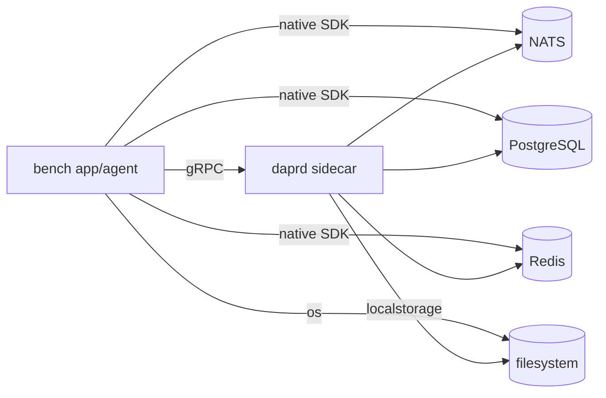

# Dapr Bench

[Dapr](https://dapr.io) is an open-source, portable runtime designed to help developers build resilient,
secure, microservices-based distributed applications and AI agents.
However, it comes with an I/O overhead caused by the additional layer introduced by Dapr.
In this work, we run the same workload against each of **NATS**, **PostgreSQL**, **Redis** and
a **filesystem** twice: once through the native Go SDK and once through Dapr. A step is a fixed
batch of tasks shared by a number of agents, the load is swept along agents and payload size,
and every step is recorded as a trace, so the overhead becomes a curve, not a guess.
These results should be taken into consideration when deciding whether to switch to Dapr.

> As Gamora asked Thanos: **“What did it cost?”**
> And Thanos replied: **“Everything.”**

## The eight connectors

| Connector         | Path                                        | Heavy ops         | Light op `stat`              |
| ----------------- | ------------------------------------------- | ----------------- | ---------------------------- |
| `nats-direct`     | app → nats.go (JetStream, acked)            | `publish`         | 1-byte acked publish         |
| `nats-dapr`       | app → gRPC → daprd → NATS JetStream         | `publish`         | 1-byte publish               |
| `postgres-direct` | app → pgx → PostgreSQL                      | `write`, `read`   | `SELECT 1 WHERE key`         |
| `postgres-dapr`   | app → gRPC → daprd → PostgreSQL             | `write`, `read`   | get of a 1-byte marker row   |
| `redis-direct`    | app → go-redis → Redis                      | `write`, `read`   | `EXISTS`                     |
| `redis-dapr`      | app → gRPC → daprd → Redis                  | `write`, `read`   | get of a 1-byte marker key   |
| `fs-direct`       | app → os file I/O on a shared volume        | `write`, `read`   | `stat` of the file           |
| `fs-dapr`         | app → gRPC → daprd → localstorage binding   | `write`, `read`   | get of a 1-byte marker file  |

Heavy operations carry the payload; `stat` is the lightest call each API offers that touches a
key without moving data. Together they separate per-call overhead from the cost of moving
bytes. The Dapr state and binding APIs have no exists call, so their `stat` fetches a one-byte
marker record seeded next to every key.

A run compares one pair, a backend's direct and Dapr connectors, measured one at a time so the
backend and the sidecar only ever serve the connector under test. Only that backend's
containers are started. The only difference within a pair is the sidecar hop.



## Quick start

```sh
make sweep BACKEND=redis     # start redis + the pair + sidecar, sweep redis-direct vs redis-dapr, follow the log
make sweep-all               # nats, postgres, redis, fs back to back, one trace file each
make plots                   # charts + summary tables from traces/*.jsonl into plots/
make down                    # tear everything down
```

Each run writes `traces/<timestamp>-<backend>.jsonl` and exits. The large-payload and
million-agent points need a machine with memory to match; see
[sizing](docs/traces-and-plots.md#sizing-the-machine).

## Dimensions

A step is a fixed amount of work: **tasks** (operations) shared by **agents** (concurrent
callers), each moving a **payload**. Every agent is closed loop: it takes the next task the
moment its previous call returns, so a step measures how fast a path serves that many callers,
and the makespan is how long the group waits for all its work to finish. Two dimensions are
swept, each under its own profile rather than every combination: large payloads are moved by a
single agent, and many agents move a small payload.

| Dimension       | Levels                                                            | Range           | Driven as                         |
| --------------- | ----------------------------------------------------------------- | --------------- | --------------------------------- |
| **Agents**      | `1, 8, 32, 128, 512, 2048, 8192, 32768, 131072, 1000000`          | 1 to 1,000,000  | 256 B payload                     |
| **Payload**     | `256, 1024, 4096, 16384, 1 MiB, 16 MiB, 128 MiB, 1 GiB`           | 256 B to 1 GiB  | 1 agent                           |
| **Tasks**       | `TASKS`, default 100,000                                          | any             | shrinks with payload, never below the agents |

Tasks alternate over a connector's ops (`write`, `read`, `stat`, ...), so each op gets an
equal share and is reported on its own. At large payloads the tasks shrink so a step never
moves more than 8 GiB (8192 tasks at 1 MiB, 8 at 1 GiB), and the keyspace shrinks so the
seeded dataset stays under 256 MiB. Per op: 5 s deadline; per step: 30 min deadline, after
which the step is recorded as truncated. See [docs/methodology.md](docs/methodology.md) for the
procedure and [docs/traces-and-plots.md](docs/traces-and-plots.md) for every knob.

## Experiments

Every experiment is the same binary with different levels, so runs are additive: the plotter
merges every trace in `traces/`, and the later measurement of a point wins. Pick a backend
with `BACKEND=` (nats, postgres, redis, fs); the commands below show one. An empty list skips
a dimension.

### 1. Per-call overhead

*What does the sidecar hop cost on its own?*

```sh
SWEEP_AGENTS=1,8 SWEEP_PAYLOAD_BYTES= make sweep BACKEND=redis
```

Read `stat_vs_agents.svg`: the light op is almost pure per-call overhead, so the gap between
the lines is the hop itself. Compare with `write_vs_agents.svg` to see how much of a heavy
op's cost is the hop. Seconds per step.

### 2. Scaling with agents

*How does each path scale as more callers share the work, and where does it saturate?*

```sh
SWEEP_AGENTS=1,8,32,128,512,2048 SWEEP_PAYLOAD_BYTES= make sweep BACKEND=postgres
```

In `write_vs_agents.svg` throughput should climb and then flatten; where the direct line keeps
climbing and the Dapr line flattens, the sidecar is the bottleneck. The `makespan` column of
`summary.md` is the agents' view: how long the whole batch took. Minutes per backend.

### 3. Fan-in: thousands to a million agents

*Where does the client, the sidecar, or the storage break under massive concurrency?*

```sh
TASKS=1000000 SWEEP_AGENTS=8192,32768,131072,1000000 SWEEP_PAYLOAD_BYTES= make sweep BACKEND=redis
```

A million tasks so every agent has work. Watch latency and the error-rate panel together: the
direct Redis and Postgres clients hold 32 connections, so agents queue on the pool, the queue
becomes latency and then 5 s timeouts. On the Dapr side the sidecar's stream limit does the
same. The level at which errors appear is the breakpoint. Needs 32 to 64 GB of RAM at the
top level; see [sizing](docs/traces-and-plots.md#sizing-the-machine).

### 4. Bytes moved: payload scaling

*How does each path scale with value size, and what does the hop cost relative to the bytes?*

```sh
SWEEP_AGENTS= SWEEP_PAYLOAD_BYTES=256,4096,65536,1048576,16777216 make sweep BACKEND=fs
```

One agent. `write_vs_payload.svg` and `read_vs_payload.svg` should slope up with size;
`stat_vs_payload.svg` should stay flat, because the light op never moves the payload. Where
the Dapr heavy line pulls away from the direct one faster than the hop alone explains, the
component is doing extra work on the bytes (base64, Lua, CloudEvent).

### 5. Size limits

*Which path refuses a value first, and at what size?*

```sh
SWEEP_AGENTS= SWEEP_PAYLOAD_BYTES=67108864,134217728,536870912,1073741824 OP_TIMEOUT=60s make sweep BACKEND=postgres
```

The error-rate panel goes to 100% where a path hits a ceiling, and `first_error` in the trace
says whose: NATS at 64 MB, Dapr's Postgres store near 255 MB (`jsonb`), Redis at 512 MB,
Postgres `bytea` at 1 GB, gRPC at 2 GiB for everything through Dapr. Tasks and keyspace shrink
to a handful at these sizes. Needs 6x the largest value in RAM across app and sidecar.

### 6. Many keys, many files

*Does a large dataset change the picture: cache misses, directory size, index depth?*

```sh
KEYSPACE=1000000 MAX_DATASET_BYTES=1073741824 TASKS=1000000 SWEEP_AGENTS=8,512 SWEEP_PAYLOAD_BYTES= make sweep BACKEND=fs
```

A million keys at 256 B, a million tasks. Compare against experiment 2 at 1000 keys: a flat
difference is the hop, a growing one is the storage (Postgres index depth, a million-entry
directory, Redis memory). Seeding a million keys dominates the time (about ten minutes per step
for `fs-dapr`), and the data disk needs a few million inodes (XFS, or ext4 formatted with more).

### 7. Payload and agents together

*Do the two dimensions interact?*

```sh
SWEEP_MODE=grid SWEEP_PAYLOAD_BYTES=256,65536,1048576 SWEEP_AGENTS=1,32,512 make sweep BACKEND=redis
```

Every combination. The plotter writes one chart per held level
(`write_vs_payload_at_agents32.svg`, ...), so the family of curves shows whether large values
under many agents degrade faster than either dimension alone. Memory is agents times payload
times a few copies: keep the product small.

### 8. A big batch

*How long do N agents take to get a million operations done, with and without Dapr?*

```sh
TASKS=1000000 AGENTS=64 PAYLOAD_BYTES=4096 SWEEP_AGENTS= SWEEP_PAYLOAD_BYTES= make sweep BACKEND=redis
```

One point, a million tasks. The `makespan` column of `summary.md` is the answer, and the
`timeouts` and `first_error` fields say whether the rare 5-second hangs on the Dapr path
recurred over a long batch. Repeat with `OP_TIMEOUT=1s` to count hangs a 5 s deadline hides.

### 9. Storage versus storage

*Which backend falls behind first, sidecar aside?*

```sh
COMPOSE_PROFILES=redis,postgres CONNECTORS=redis-direct,postgres-direct SWEEP_PAYLOAD_BYTES= make sweep
```

Two direct connectors instead of a pair. The plotter charts backends separately, so read the
`summary.md` tables side by side. Any two direct connectors work (`fs-direct,redis-direct`,
`nats-direct,postgres-direct`); start the profiles of every backend involved. A Dapr connector
can be mixed in only for the backend named by `BACKEND`, since the sidecar loads that backend's
component alone.

### Everything

```sh
make sweep-all     # nats, postgres, redis, fs with the default levels: experiments 1 to 5 in one go
```

## Results

No results are checked in yet for this version of the benchmark. Run a sweep and `make plots`;
charts land in `plots/<backend>/` with a `summary.md` beside them.

## Documentation

- [docs/methodology.md](docs/methodology.md): the step model (tasks, agents, payload), the
  sweep profiles, how tasks and keyspace shrink with payload, fairness notes.
- [docs/traces-and-plots.md](docs/traces-and-plots.md): the trace record format, plotting,
  every configuration variable, the Prometheus live view.

## Layout

```
cmd/bench/            entrypoint: builds the pair, connects, runs the sweep
internal/connector/   one file per backend, holding both its direct and Dapr client
internal/runner/      one measured step: tasks shared by closed-loop agents
internal/sweep/       the load schedule and the trace writer
internal/stats/       log-linear histogram behind the percentiles
internal/metrics/     Prometheus exporter for the live view
deploy/               compose stack, Dapr components, Prometheus config + rules
scripts/              the SVG plotter and summary table
docs/                 methodology and reference
traces/               one .jsonl per run
plots/                charts and summary tables generated from traces/ (not checked in)
```
